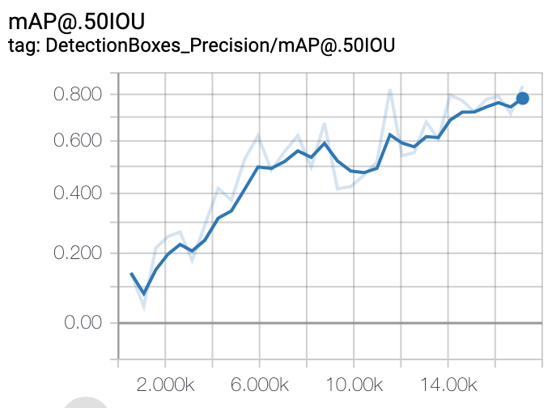

## First, let's set up the environnement

mkdr tfod
cd tfod
git clone https://github.com/tensorflow/models
virtualenv tfodenv
source activate tfodenv

pip install tensorflow
Cython - 0.29.3
contextlib2 - 0.5.5
pillow - 5.4.1
lxml - 4.3.0
jupyter
matplotlib

cd models/research
wget -O protobuf.zip https://github.com/google/protobuf/releases/download/v3.0.0/protoc-3.0.0-linux-x86_64.zip
unzip protobuf.zip
./bin/protoc object_detection/protos/*.proto --python_out=.

/*

nano .bashrc
add this line :
export PYTHONPATH=$PYTHONPATH:`/home/paperspace/tfod/models/research`:`/home/paperspace/tfod/models/research`/slim

shutdown machine and restart
sudo shutdown -P now

python object_detection/builders/model_builder_test.py

git clone https://github.com/pdollar/coco.git
cd coco/PythonAPI
make
make install
python setup.py install


## Configuring the training pipeline

I will use one of the pre-trained models provided in TensorFlow Object detection API.
The model we will be using in this case is ssd_mobilenet_v1_coco. It is always a trade-off between accuracy and speed.

Download :
- configuration file : https://github.com/tensorflow/models/blob/master/research/object_detection/samples/configs/ssd_mobilenet_v1_coco.config
- the latest pre-trained weights for the model : http://download.tensorflow.org/models/object_detection/ssd_mobilenet_v1_coco_2018_01_28.tar.gz , extract its content in training_demo/pre-trained-model/

Below are the changes that we shall need to apply to the downloaded .config file:

```
model {
  ssd {
    num_classes: 1  #number of classes to be trained on

[...]

train_config: {
  batch_size: 24 #increase or decrease depending of GPU memory usage

[...]

  fine_tune_checkpoint: "/home/paperspace/tensorflow/training_PM/pre-trained-model/model.ckpt"    #Path to extracted files of pre-trained model

  from_detection_checkpoint: true
[...]

train_input_reader: {
  tf_record_input_reader {
    input_path: "/home/paperspace/tensorflow/training_PM/data/train.record"   #Path to training TFRecord file
  }
  label_map_path: "/home/paperspace/tensorflow/training_PM/data/label_map.pbtxt"  #Path to label map file
}

[...]

eval_input_reader: {
  tf_record_input_reader {
    input_path: "/home/paperspace/tensorflow/training_PM/data/test.record"  # Path to testing TFRecord
  }
  label_map_path: "/home/paperspace/tensorflow/training_PM/data/label_map.pbtxt"   # Path to label map file

}
```
## Upload data set and config files to Paperspace VM

ssh to the machiune and :
scp -r /localfolder/ paperspace@[publicIP]:./Desktop/


## Fine-tuning a model using model_main.py

source : https://github.com/tensorflow/models/blob/master/research/object_detection/g3doc/running_locally.md#running-the-training-job

Installing Coco evaluation metrics:
git clone https://github.com/pdollar/coco.git

cd coco/PythonAPI
make
make install
python setup.py install

# From the training directory

PIPELINE_CONFIG_PATH=pipeline_PM.config
MODEL_DIR=training/
NUM_TRAIN_STEPS=25000
SAMPLE_1_OF_N_EVAL_EXAMPLES=1
python model_main.py \
    --pipeline_config_path=${PIPELINE_CONFIG_PATH} \
    --model_dir=${MODEL_DIR} \
    --num_train_steps=${NUM_TRAIN_STEPS} \
    --sample_1_of_n_eval_examples=$SAMPLE_1_OF_N_EVAL_EXAMPLES \
    --alsologtostderr


# Monitor with tensorboard:

First, install a ssh tunnel :
wget https://bin.equinox.io/c/4VmDzA7iaHb/ngrok-stable-linux-amd64.zip
unzip ngrok-stable-linux-amd64.zip

launch tensorboard
tensorboard --logdir=training
./ngrok http 6006

(source : https://ngrok.com/docs)

# Monitor GPU usage
$ nvidia-smi -l


## Hyperparameters tuning :

- training_PM_1:
'default settings' of config file
11k steps
batch_size = 24


- training_PM_2 :
26k steps
batch_size = 1
detects eveything at first...and then nothing !
mAP close to zero


- training_PM_2 :
batch_size = 1024
GPU memory usage is saturated but volatge is low
trains very slowly

- training_PM_3 :
batch_size = 192
ResourceExhaustedError (see above for traceback): OOM when allocating tensor with shape[192,256,38,38] and type float on /job:localhost/replica:0/task:0/device:GPU:0 by allocator GPU_0_bfc

batch_size = 48


- training_PM_4 :
12k steps
batch_size = 48
mAP 0,32
mAP @.50IOU 0,72
loss 1.3
exported inference graph to /Users/pm/Documents/AI/compvision/Object_detection/tfod/models/research/object_detection/output_inference_graph_PM_4

slower to train due to data augment options (it seems the data augmentation operations are done by CPU before each batch/step and then processed by GPU, many I/O)
data_augmentation_options {
  random_horizontal_flip {
  ssd_random_crop {
  random_adjust_brightness {
  random_adjust_contrast {
  random_adjust_hue {
  random_adjust_saturation {
  random_distort_color {

source : https://github.com/tensorflow/models/blob/master/research/object_detection/core/preprocessor.py

- training_PM_5:
redo with the 'default settings' of config file
batch_size = 24
after 20k steps:
mAP 0,37
mAP @.50IOU 0,76
loss <1
exported frozen graph : output_inference_graph_PM_5

- training_PM_5b:
continuing training_PM_5 to more steps


- training_PM_fpn

SSD with Mobilenet v1 FPN feature extractor, shared box predictor and focal loss (a.k.a Retinanet). (See Lin et al, https://arxiv.org/abs/1708.02002)
Trained on COCO, initialized from Imagenet classification checkpoint
Achieves 29.7 mAP on COCO14 minival dataset.


Download :
ssd_mobilenet_v1_fpn_shared_box_predictor_640x640_coco14_sync.config
from : https://github.com/tensorflow/models/blob/master/research/object_detection/samples/configs/ssd_mobilenet_v1_fpn_shared_box_predictor_640x640_coco14_sync.config

Download latest pre-trained weights for the model :
http://download.tensorflow.org/models/object_detection/ssd_mobilenet_v1_fpn_shared_box_predictor_640x640_coco14_sync_2018_07_03.tar.gz

with default config params (batch_size : 64) : OOM
with batch_size : 32  // OOM
24

- in config file :
image_resizer {
  fixed_shape_resizer {
    height: 300  #down from 640
    width: 300  #down from 640
  }
ERROR : ValueError: Dimensions must be equal, but are 20 and 19 for 'FeatureExtractor/MobilenetV1/fpn/top_down/add' (op: 'Add') with input shapes: [24,20,20,256], [24,19,19,256].

SOlution : in config add "pad_to_multiple: 1" in the feature_extractor section (after depth_multiplier: 1.0)
same error

 - w/ original config (640*640), just lowering batch size, starting to 1

trains, but loss is very high and :
ERORR type :
WARNING:root:Variable [MobilenetV1/Conv2d_0/BatchNorm/beta] is not available in checkpoint
solution: added "from_detection_checkpoint: true" in config file

and also duplicates logging
solution : Open variables_helper.py in models/research/object_detection/utils/variables_helper.py and replace all occurrences of logging with tf.logging

OK, trains Now
loss is huge

trying batch_size : 8
steps : 9196
mAP:0.70
mAP 0.50 : 0.99
loss:<1.50


- training_PM_resnet

2 types of ERROR :
- WARNING:root:Variable [resnet_v1_50/conv1/BatchNorm/gamma] is not available in checkpoint
and
- ResourceExhaustedError (see above for traceback): OOM when allocating tensor with shape[16,1024,40,40] and type float on /job:localhost/replica:0/task:0/device:GPU:0 by allocator GPU_0_bfc

tried reducing batch size but not working


# About batch size
Number of parameters of the model

available GPU memory bytes  = 7491MiB
one mebibyte is equal to 1048576 bytes (https://en.wikipedia.org/wiki/Mebibyte)

number of trainable parameters = 5,1 M

Max batch size= available GPU memory bytes / 4 / (size of tensors + trainable parameters)
source : https://stackoverflow.com/questions/46654424/how-to-calculate-optimal-batch-size

Anyway, it seems to crash (OOM error) for batch_size starting at 192 (maybe even lower).

# mAP
https://stackoverflow.com/questions/47692742/tensorflow-object-detection-api-evaluation-map-behaves-weirdly


Mean average precision measures our model’s percentage of correct predictions for all labels. IoU is specific to object detection models and stands for Intersection-over-Union. This measures the overlap between the bounding box generated by our model and the ground truth bounding box, represented as a percentage. This graph is measuring the percentage of correct bounding boxes and labels our model returned, with “correct” in this case referring to bounding boxes that had 50% or more overlap with their corresponding ground truth boxes. After training 17k steps, our model achieved 83% mean average precision.
source : https://medium.com/tensorflow/training-and-serving-a-realtime-mobile-object-detector-in-30-minutes-with-cloud-tpus-b78971cf1193

Overfitting a lot to the train set ?
maybe yes, but inference will be done on very similar images (dashcam, etc...)

# Quantization
We need a scalable way to handle these inference requests with low latency. The output of a machine learning model is a binary file containing the trained weights of our model — these files are often quite large, but since we’ll be serving this model directly on a mobile device we’ll need to make it as small as possible.

This is where model quantization comes in. Quantization compresses the weights and activations in our model to an 8-bit fixed point representation. The following lines in our config file will generate a quantized model:
```
graph_rewriter {
  quantization {
    delay: 1800
    activation_bits: 8
    weight_bits: 8
  }
}
```
Typically with quantization, a model will train with full precision for a certain number of steps before switching to quantized training. The delay number above tells ML Engine to begin quantizing our weights and activations after 1800 training steps

source : https://medium.com/tensorflow/training-and-serving-a-realtime-mobile-object-detector-in-30-minutes-with-cloud-tpus-b78971cf1193

also : https://github.com/tensorflow/tensorflow/tree/master/tensorflow/contrib/quantize#quantization-aware-training


# Running inference on embedded device with tensorflow Lite
We start by getting a TensorFlow frozen graph with compatible ops that we can use with TensorFlow Lite : run the export_tflite_ssd_graph.py script from the models/research directory with this command:
```
python object_detection/export_tflite_ssd_graph.py \
--pipeline_config_path=$CONFIG_FILE \
--trained_checkpoint_prefix=$CHECKPOINT_PATH \
--output_directory=$OUTPUT_DIR \
--add_postprocessing_op=true
```
source : https://medium.com/tensorflow/training-and-serving-a-realtime-mobile-object-detector-in-30-minutes-with-cloud-tpus-b78971cf1193

for Google TPU Edge : https://coral.withgoogle.com/tutorials/edgetpu-retrain-detection/
